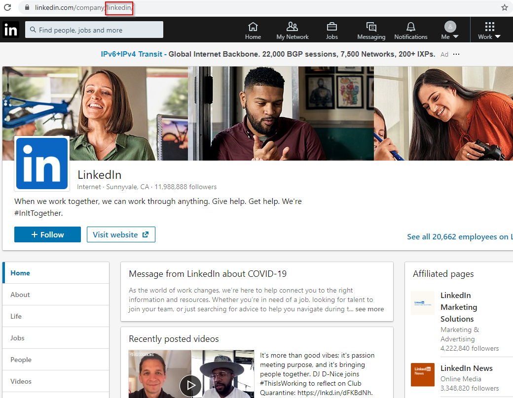

# Linkedin Parsers

## Intro
A collection of parser scripts created to scrape data off LinkedIn. The main one (and the only one at the moment) is ```linkedin2email.py```, which is capable to first extract employees name from a target organisation and spits them out in some of the most commonly seen email address formats.

## Prerequisites
### requirements.txt
This is straight-forward:
```
pip install -r requirements.txt
```

### Web Driver
Find out the version of your Google Chrome and install its corresponding chromedriver version from [here](https://chromedriver.storage.googleapis.com/index.html). For instance, if you are running Google Chrome ver. 83.0.4103 on Windows, download the correct chromedriver [here](https://chromedriver.storage.googleapis.com/83.0.4103.39/chromedriver_win32.zip).

Unzip the folder/directory locally, note down the location where the executable lies as you will need it later on.

## Usage

For the sake of demonstration, let's imagine you are red-teaming E Corp and because of limited Internet footprint, you could not find a whole lot of email addresses of the target organisation from sources such as data breaches. You then decided to give LinkedIn a go. You logged in to LinkedIn, and found out about the name of the organisation (as used by LinkedIn). For instance, if LinkedIn is our target organisation, ```linkedin``` is what you need to feed to the tool via ```-c``` parameter:



Based on your OSINT (such as looking through whois records, etc.), you established the format and domain name used in the target's email addresses. These are all you need to get started!

Now you can just point the script ```linkedin2email.py``` to the location of the downloaded chromedriver, plus providing the company and domain name so that it will be appended *automagically* for you.

*Note: As a way of paying homage to Mr. Robot, a fictional company E Corp is used below, just for demonstration.*


```
PS C:\LinkedIn-parser> python linkedin2email.py -w {chromedriver_loc} -u {linkedin_username} -p {linkedin_password} -c ecorp -d ecorp.com
[+] Success! A total of 15 employees found:
kumar asaka
khaled hadley
yamin nishikov
salman alexander
norah almugreen
camila roberta
omar alabdullah
leroy matar
cristiano cabellos
ahmed mazlan
nicolas sadiq
maha djokovic
nora alahmad
quentin murrayfield
hafiz al mukhriz


[*] Generating email addresses in the following formats:
{first_initial}{last}@ecorp.com
{first}{last}@ecorp.com
{first}.{last}@ecorp.com
{first}_{last}@ecorp.com
{first}{last_initial}@ecorp.com
{first}@ecorp.com
{last}{first_initial}@ecorp.com


[+] Email lists saved under:  C:\LinkedIn-parser\ecorp.com\*
```

Peeking inside the newly created directory/folder, email addresses in seven different formats were generated:
```
PS C:\LinkedIn-parser> ls .\ecorp.com\


    Directory: C:\LinkedIn-parser\ecorp.com


Mode                LastWriteTime         Length Name
----                -------------         ------ ----
-a----       16/06/2020     21:36           2381 first.last.txt
-a----       16/06/2020     21:36           1636 first.txt
-a----       16/06/2020     21:36           1729 firstl.txt
-a----       16/06/2020     21:36           2288 firstlast.txt
-a----       16/06/2020     21:36           2381 first_last.txt
-a----       16/06/2020     21:36           1859 flast.txt
-a----       16/06/2020     21:36           1859 lastf.txt
```

The output of these files are displayed in the following section.

### {first_initial}{last}@{domain}
```
kasaka@ecorp.com
khadley@ecorp.com
ynishikov@ecorp.com
salexander@ecorp.com
nalmugreen@ecorp.com
croberta@ecorp.com
oalabdullah@ecorp.com
lmatar@ecorp.com
ccabellos@ecorp.com
amazlan@ecorp.com
nsadiq@ecorp.com
mdjokovic@ecorp.com
nalahmad@ecorp.com
qmurrayfield@ecorp.com
halmukhriz@ecorp.com
```
### {first}{last}@{domain}
```
kumarasaka@ecorp.com
khaledhadley@ecorp.com
yaminnishikov@ecorp.com
salmanalexander@ecorp.com
norahalmugreen@ecorp.com
camilaroberta@ecorp.com
omaralabdullah@ecorp.com
leroymatar@ecorp.com
cristianocabellos@ecorp.com
ahmedmazlan@ecorp.com
nicolassadiq@ecorp.com
mahadjokovic@ecorp.com
noraalahmad@ecorp.com
quentinmurrayfield@ecorp.com
hafizalmukhriz@ecorp.com
```
### {first}.{last}@{domain}
```
kumar.asaka@ecorp.com
khaled.hadley@ecorp.com
yamin.nishikov@ecorp.com
salman.alexander@ecorp.com
norah.almugreen@ecorp.com
camila.roberta@ecorp.com
omar.alabdullah@ecorp.com
leroy.matar@ecorp.com
cristiano.cabellos@ecorp.com
ahmed.mazlan@ecorp.com
nicolas.sadiq@ecorp.com
maha.djokovic@ecorp.com
nora.alahmad@ecorp.com
quentin.murrayfield@ecorp.com
hafiz.almukhriz@ecorp.com
```
### {first}_{last}@{domain}
```
kumar_asaka@ecorp.com
khaled_hadley@ecorp.com
yamin_nishikov@ecorp.com
salman_alexander@ecorp.com
norah_almugreen@ecorp.com
camila_roberta@ecorp.com
omar_alabdullah@ecorp.com
leroy_matar@ecorp.com
cristiano_cabellos@ecorp.com
ahmed_mazlan@ecorp.com
nicolas_sadiq@ecorp.com
maha_djokovic@ecorp.com
nora_alahmad@ecorp.com
quentin_murrayfield@ecorp.com
hafiz_almukhriz@ecorp.com
```
### {first}{last_initial}@{domain}
```
kumara@ecorp.com
khaledh@ecorp.com
yaminn@ecorp.com
salmana@ecorp.com
noraha@ecorp.com
camilar@ecorp.com
omara@ecorp.com
leroym@ecorp.com
cristianoc@ecorp.com
ahmedm@ecorp.com
nicolass@ecorp.com
mahad@ecorp.com
noraa@ecorp.com
quentinm@ecorp.com
hafiza@ecorp.com
```
### {first}@{domain}
```
kumar@ecorp.com
khaled@ecorp.com
yamin@ecorp.com
salman@ecorp.com
norah@ecorp.com
camila@ecorp.com
omar@ecorp.com
leroy@ecorp.com
cristiano@ecorp.com
ahmed@ecorp.com
nicolas@ecorp.com
maha@ecorp.com
nora@ecorp.com
quentin@ecorp.com
hafiz@ecorp.com
```
### {last}{first_initial}@{domain}
```
asakak@ecorp.com
hadleyk@ecorp.com
nishikovy@ecorp.com
alexanders@ecorp.com
almugreenn@ecorp.com
robertac@ecorp.com
alabdullaho@ecorp.com
matarl@ecorp.com
cabellosc@ecorp.com
mazlana@ecorp.com
sadiqn@ecorp.com
djokovicm@ecorp.com
alahmadn@ecorp.com
murrayfieldq@ecorp.com
almukhrizh@ecorp.com
```

## Disclaimers
Scripts worked as of mid June 2020; LinkedIn does change stuff from time to time, so the scripts may require minor tweaking from time to time.
